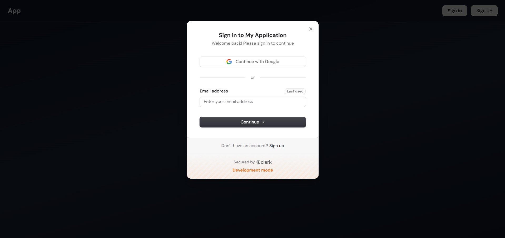
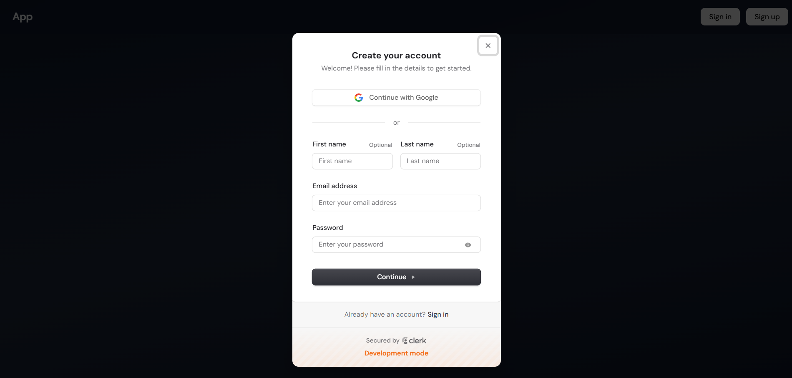
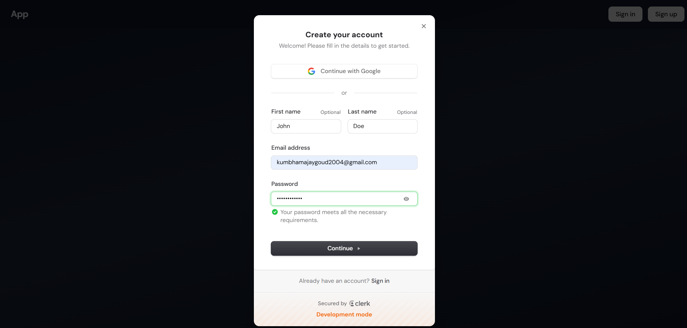
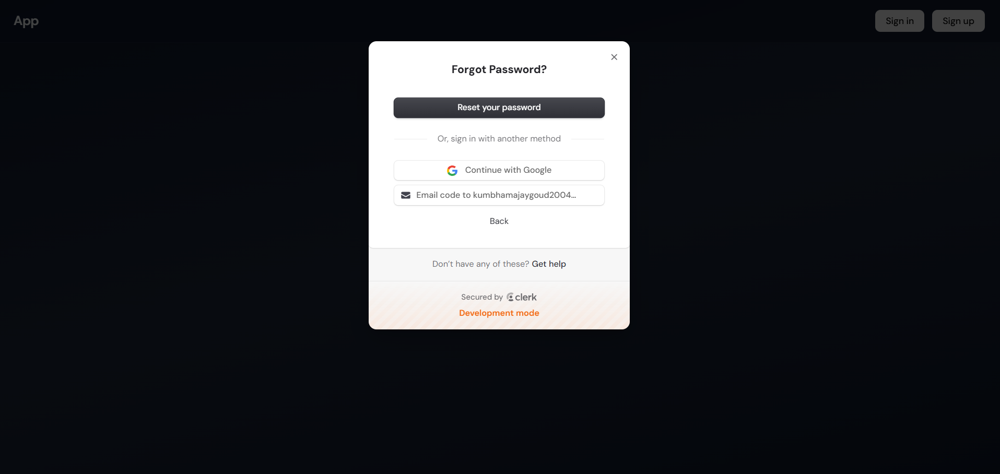
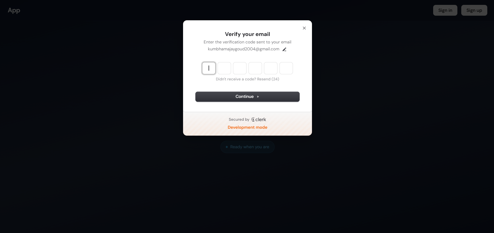
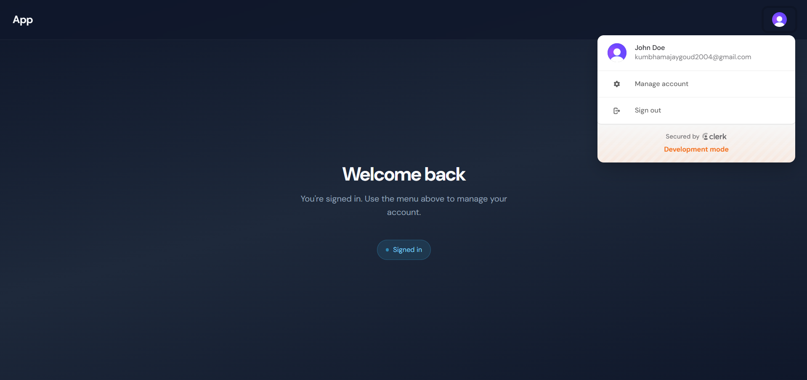
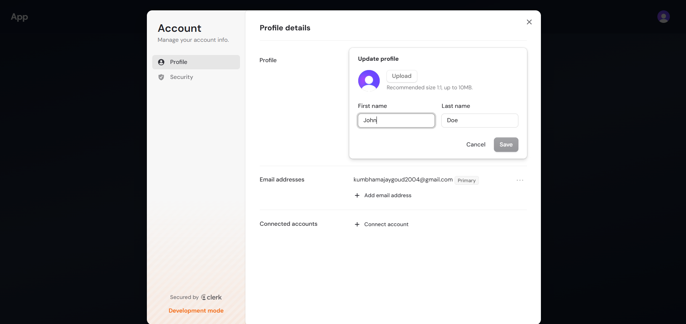
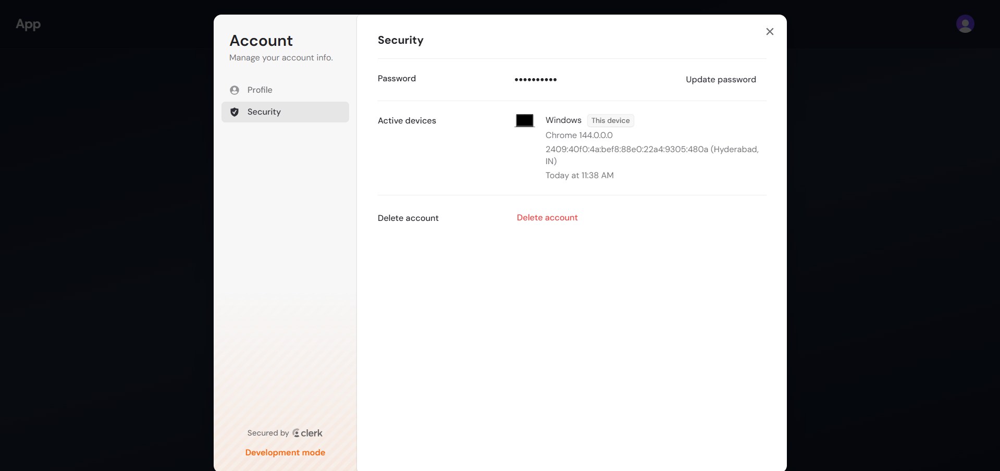

# Clerk Auth System

<div align="center">

[](https://opensource.org/licenses/MIT)
[](https://reactjs.org/)
[](https://www.typescriptlang.org/)
[](https://clerk.com/)
[](https://vitejs.dev/)
[](https://github.com/clerk-auth-system/graphs/commit-activity)
[](https://secure-auth-service.vercel.app/)

</div>

A production-ready authentication foundation built with React, Vite, and Clerk. This repository provides a robust, pre-configured starting point for applications requiring secure, scalable, and delightful user authentication experiences.

**🔗 Live Demo:** [https://secure-auth-service.vercel.app/](https://secure-auth-service.vercel.app/)


## Overview

This project implements a complete authentication lifecycle, from registration and multi-factor authentication to advanced account management. It is designed with production standards in mind, utilizing modern tooling and best practices to ensure security, performance, and developer productivity.

## Key Features

- **Standardized Authentication**: Secure sign-in, sign-up, and forgot password flows.
- **Root-Level Integration**: Centralized `ClerkProvider` implementation for seamless state management.
- **Secure Sessions**: Built-in handling of session persistence and JWT management.
- **Account Management**: Comprehensive user profile and security settings interface.
- **Production Tooling**: Pre-configured TypeScript, ESLint, and Vite environment.
- **Responsive UI**: Optimized for all screen sizes with accessible components.

## Technical Architecture

The system is built on a modern frontend stack:

- **Framework**: [React](https://reactjs.org/)
- **Build Tool**: [Vite](https://vitejs.dev/)
- **Authentication**: [Clerk](https://clerk.com/)
- **Language**: [TypeScript](https://www.typescriptlang.org/)
- **Linter**: [ESLint](https://eslint.org/)

## Visual Showcase


*Figure 1: Standardized Sign In interface.*


*Figure 2: Initial Sign Up state.*


*Figure 3: Registration flow with user input.*


*Figure 4: Secure password recovery workflow.*


*Figure 5: Email verification checkpoint.*


*Figure 6: Authenticated dashboard and user menu.*


*Figure 7: User profile management.*


*Figure 8: Account security and session settings.*


## Quick Start

### 1. Installation
```bash
npm install
```

### 2. Configure Credentials
Add your Clerk Publishable Key to `.env.local`:
```env
VITE_CLERK_PUBLISHABLE_KEY=your_publishable_key
```

### 3. Launch Development Server
```bash
npm run dev
```

For comprehensive instructions, please refer to the [Setup Guide](./docs/SETUP.md).

## Project Structure

```text
├── docs/               # Documentation and assets
│   ├── screenshots/    # UI reference images
│   └── SETUP.md        # Detailed setup guide
├── src/                # Application source code
│   ├── assets/         # Static assets
│   ├── main.tsx        # Application entry point & ClerkProvider
│   └── App.tsx         # Root component & auth routing
└── vite.config.ts      # Build configuration
```

## Security and Compliance

This system leverages Clerk's security infrastructure, including:
- SOC 2 Type II compliance
- GDPR and CCPA readiness
- Built-in bot protection and brute-force prevention

## License

This project is licensed under the MIT License.
